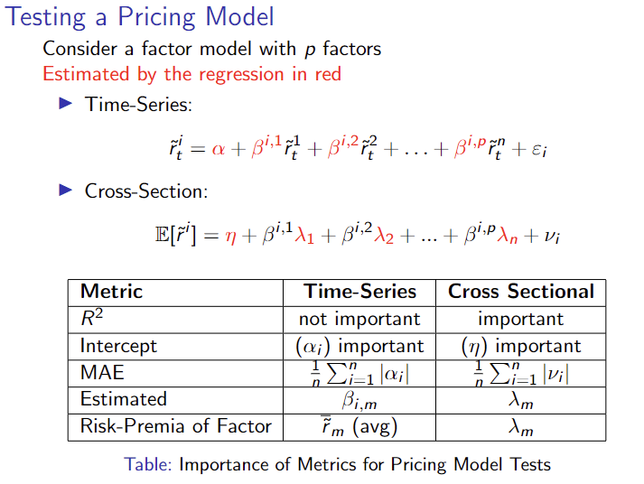

# Homework 4 / CAPM
## Notes DFA Case

- Explote small/micro-cap equity opportunities  and in value stocks (high book to market ratio) -> Based on academic research and lack of these products
- These excess returns in the market are earned by bearing risk
- Based on the assumption of efficiency of markets (all information all ready incorporated to the price) -> They don't rely on individual equity analysis or macroeconomic strategies
- DFA's funds follow a index-like strategies but with a component of active management 
- On the 80s, DFA faced a challenge due to deep recession that particularly affected to small companies -> After this episode, the premium of "size factor" was unattractive and the growth stocks outperformed value

## Notes Theory 

### CAPM : 

$$ E[r^{i}] = \beta^{i,m}E[r^{m}] + \epsilon^{i}  \space (1)$$
$$ \beta^{i,m} = \frac{Cov(r^{i},r^{m})}{Var(r^{m})} \space (2)$$
$$ \frac{ E[r^{i}] }{\sigma^{i}} = \rho^{i,m}\frac{ E[r^{m}] }{\sigma^{m}} \implies (SR)^{i} = \rho^{i,m}(SR)^{m}  \space (3)$$
$$ Teynor Ratio = \frac{ E[r^{i}] }{\beta^{i,m}} = E[r^m] \space \forall i \space (4)$$

- (1) This implies that market beta is the only risk associated with higher returns

- (3) The $\max(SR^i) = 1(SR)^m$

- (4) If the CAPM were true, the Teynor Ratios would be the same for all the assets and constant equal to the expected market premium

- Alphas would also be equal to zero (mean-absolute-error := $MAE = \frac{1}{n} \sum_{i=1}^{n} |\alpha_i| \space != 0  $), then the Information Ratio should be zero too

- If CAPM were true, with a cross-sectional validation: $$\mu_i = \eta + \lambda_m\beta^{i,m} + \epsilon$$
    - $R^2$ should be high: dependent variable (portfolio mean returns) should be explained entirely by the level of market risk ($\beta^{i,m}$ estimated in the time-series regressions) 
    - $\lambda_m$ should be equal the market premium 
    - The intercept ($\eta$) should be zero, reflecting that one should not get any excess mean retruns if they take no market risk

### Fama-French 3 factor model

$$ E[r^{i}] = \beta^{i,m}E[r^{m}] + \beta^{i,s}E[SMB] + \beta^{i,v}E[HML] + \epsilon^{i} $$

- Size (SMB) : Small minus big market capitalization
- Value (HML) : High (value) minus low (grown) book-to-market ratio.    
    - **Value** -> Low price relative to some firm fundamentals. 
    - **Growth** -> High valuation with respect to these measures

### How to test a time-varying betas

This comes from Fama-MacBeth at the end of Lecture 4. 

1. Estimate a the time-series regression using a rolling window or other methods, we want an estimate of $\beta_{t}^i$, that is, the beta for asset $i$ at time $t$.
2. Run a cross-sectional regression for each time, $t$. That is, calculate the cross-section regression using the $\beta_{t}$, for each time $t$. We do this to calculate $\lambda$ and $v$.
3. We can then take the sample means of each of the estimates to get the final estimates of $\lambda$ and $v$.

Let's assume we are using t-window rolling regression. For TS regression we have N * (T - t+1) regressions where N is the number of assets and T is the total number of time periods. For CS regression we have (T-t+1) regression for each of the time periods. Thus, the total number of regressions is (N + 1) * (T - t+1)

# Homework 5 / Multi-Factor models

## Notes Case (Smart Beta)

- By taking lon-short position, FF tried to reduce the correlation between them

- Smart-bet EFT: combination of passive and active investing, they track a factor index and will thus be long-short (careful, ETF for regulation can't take a significant portion in short position, therefor these ETF are "tiled" the the factor charasteristics)

- Value (`HML`) is realtively redundant for the FF5, the correlation with Investment Factor (`CMA`) is almost 70% and the correlation with Quality Factor (`RMW`) is 22%

## Theory Notes

$$ CAPM := E[r^{i}] = \beta^{i,m}E[r^{m}] + \epsilon^{i}  \space $$ 
$$ FF-3F := E[r^{i}] = \beta^{i,m}E[r^{m}] + \beta^{i,s}E[SMB] + \beta^{i,v}E[HML] + \epsilon^{i} $$
$$ FF-5F := E[r^{i}] = \beta^{i,m}E[r^{m}] + \beta^{i,s}E[SMB] + \beta^{i,v}E[HML] + \beta^{i,quality}E[RMW] + \beta^{i,inv}E[CMA] + \epsilon^{i} $$
$$ AQR := E[r^{i}] = \beta^{i,m}E[r^{m}] + \beta^{i,v}E[HML] + \beta^{i,quality}E[RMW] + \beta^{i,mom}E[UMD] + \epsilon^{i} $$

- The factors are constructed using:

    - **Size Factor** (Small minus Big -- SMB): Small cap minus big cap. Split stocks into 5 quantiles, long smallest quantile and short largest quantile (by market cap).

    - **Value Factor** (High minus Low -- HML): High book-to-market ratio minus low book-to-market ratio. Split stocks into 5 quantiles, long highest quantile and short lowest quantile (by book-to-market ratio).

    - **Quality Factor** (Robust minus Weak -- RMW): Robust operating profitability minus weak operating profitability (operating profitability = revenius - costs). Split stocks into 5 quantiles, long highest quantile and short lowest quantile (by operating profitability).

    - **Investment Factor** (Conservative minus Aggressive -- CMA): Conservative investment (low levels of investment) minus aggressive investment. Split stocks into 5 quantiles, long lowest quantile and short lowest highest (by investment).

    - **Momentum** (Up minus Down -- UMD): Up minus down. Split stocks into 5 quantiles, long highest quantile and short lowest quantile (by returns in previous year).

- In the time-series analysis of a **pricing factor model**, it is not a problem to have a **R-Squared = 0**, it means that the beta is zero, therefor the expected return of the asset is the risk-free rate. But if the alpha is differnt to zero is a problem, it means that the asset is on averege getting compensated more/less than the risk-free due to risk non-associated with the factors

- In the **Linear Factor Descomposition (LFD)** it is a problem to have a R-Squared close to zero, it means that your regressors (factors) are no able to capture variability of the target asset. Therefore, you can't excecute a correct hedge and if you're tracking instrument is expected to have a very poor performance. In LFD is not a problem to have an alpha different to zero

# Homework 6 / 

## Case Notes

- AQR Momentum product is a mutual fund, allowing to retail investor to take this type of exposition. it has a Long-only legal limitation, retricting the use of short positions or leverage and they have to be ready to return capital at the end of the trading day (Open-end)

- This mutual fund wil not track exactly the momentum index due to: (1) the Long-Only construction,  of FF (Long-Short position) -> high correlation with the market (90%); (2)  the index assume a monthly rebalance (high transaction cost) while AQR used a quarterly rebalance; (3) FF Factor used all listed stocks and AQR has to use liquid stocks 

- They construct the momentum portfolio using returns from t-12 to t-2, due to the winning/losing stocks between t-1 and t may show short-term reversal

## Barnstable approach

- Assumptions:  log iid returns, normally distributed
- Implications:
    - Sharpe ratio scales with time, meaning that in the long-run we would expect to have a higher Sharpe, and thus it would be a safer investment. Additionally, we'll have lower standard error of average returns.

    - Riskier because volatility also scales with time! That means our cumulative returns will have higher volatility (despite a higher Sharpe) and thus they could be considered riskier in the long run. We also have parameter uncertainty, meaning that we are less certain about the parameters in the long run, so we have "model risk" in the long run.

Application Example: Probability that MKT will outperform HML in the following 5y:

First, we assume log-returns of MKT and HML are iid multivariate normal.

We want

$$P\left(\Pi_{t=1}^{60} (1+r_t^{MKT}) > \Pi_{t=1}^{60} (1+r_t^{HML})\right)$$

Denote log-return $\mathrm{r} = \log(1+r)$ and let $\mathrm{r}^P = \mathrm{r}^{MKT} - \mathrm{r}^{HML}$.

$$
\begin{aligned}
P\left(\Pi_{t=1}^{60} (1+r_t^{MKT}) > \Pi_{t=1}^{60} (1+r_t^{HML})\right) 
&= P\left(\sum_{t=1}^{60} \mathrm{r}_t^{MKT} > \sum_{t=1}^{60} \mathrm{r}_t^{HML}\right) \\
&= P\left(\sum_{t=1}^{60} (\mathrm{r}_t^{MKT} - \mathrm{r}_t^{HML}) > 0 \right) \\
&= P\left(\sum_{t=1}^{60} \mathrm{r}_t^{P} > 0 \right) \\
&= P\left(\bar{\mathrm{r}}_t^{P} > 0 \right) \\
&= 1- \Phi\left(\sqrt{60}\frac{-\mu}{\sigma}\right) = \Phi\left(\sqrt{60}\frac{\mu}{\sigma}\right)
\end{aligned}
$$

The last equation comes from

$$\bar{\mathrm{r}}^P \sim \mathcal{N}\left(\mu, \frac{1}{60}\sigma^2\right)$$

where

$$\mu = \mu_{MKT} - \mu_{HML}$$ 
$$\sigma^2 = \sigma_{MKT}^2 + \sigma_{HML}^2 - 2\sigma_{MKT, HML}$$

or can directly calculate $\mu$ and $\sigma$ from the spread between the two.

In case of using annualized $\mu$ and $\sigma$, the distribution should be the average of 5 years of annualized returns
$$\bar{\mathrm{r}}_{annual}^P \sim \mathcal{N}\left(12\mu, \frac{12}{5}\sigma^2\right)$$

$$
\Phi\left(\frac{12\mu}{\sqrt{12/5}\sigma}\right) = \Phi\left(\sqrt{60}\frac{\mu}{\sigma}\right)
$$

Which is equivalent to the above.
